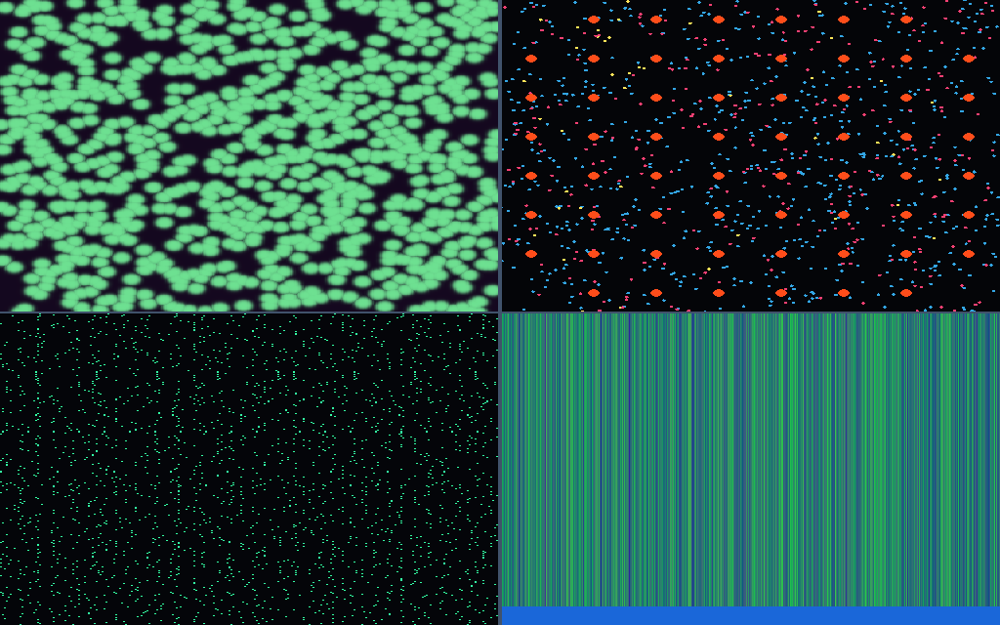
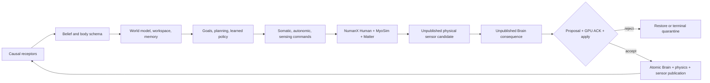

# NumiBrain

<p align="center">
  <strong>A transactional nervous system for embodied intelligence on Apple silicon.</strong><br>
  Perception, memory, learning, action, and physics advance as one accepted reality.
</p>

<p align="center">
  
  
  
  
  
</p>

NumiBrain is the neural half of **NumanX**: an Apple-native embodied-agent
runtime coupling a GPU-resident brain to articulated Human, MyoSim muscle,
Matter deformable physics, and causal sensors. It is built around one demanding
idea:

> A brain must never learn from a future the body rejected.



<p align="center"><sub>Real Apple-M4 Metal frame from the simulation-only Numi Neuron Lab. Quadrants: phase/tubulin, 1,000-neuron + 60-electrode activity, 256-tick raster, and 50,000-synapse weight/depression state.</sub></p>

Every physical candidate and every neural consequence remain private until one
root protocol accepts them together. Rejection restores the prior physical and
neural reality; acceptance publishes one complete Brain + physics + sensor
generation.

## Why this architecture matters

Most embodied-AI stacks connect a policy to a simulator through a sequence of
loosely coordinated host calls. NumiBrain makes the boundary itself part of the
model:

- **One causal history.** Recurrent state, memory, plasticity, random counters,
  muscle state, deformable state, and sensors advance only on an accepted root.
- **GPU-native time.** Metal owns the hot perception-to-action loop, physical
  timestamps, sparse event routing, inference, and transactional shadows.
- **Embodiment, not pose control.** Normal actions are muscle, autonomic, and
  active-sensing commands; normal observations are delayed, validity-gated
  receptors—not privileged simulator state.
- **Safety through ownership.** Events provide ordering, while versioned
  records, exact resource identity, terminal command status, and state-derived
  proofs provide authority.
- **Evidence before promotion.** Correctness, physical fidelity, learning,
  throughput, biological usefulness, and safety are separate gates. A smaller
  result remains evidence; it is never renamed as the target.

## One root, one reality



The close protocol is mutation-free proposal → Brain preflight → GPU ACK →
Matter-then-Human apply/restore → publication reservation → private Brain flip
→ joint fence → physical and sensor release. No public reader is allowed to
observe a mixed root.

## Verified frontier

| Gate | State | Current evidence boundary |
|---|---|---|
| **A — Transactional root** | **Complete** | A real 157-body, `nq=129`/`nv=128`, 416-muscle Human and attached Matter world execute the ABI4 root protocol on Apple M4. Accepted roots advance once; rejected retries restore and replay exactly. |
| **B — Causal sensorium** | **Complete** | Proprioception, muscle-local physiology, kinesthesia, vestibular state, touch, vision/depth, and audition have bounded accepted-root causal intervention evidence. Autonomous gaze changes physical rays and valid coverage. |
| **C — Learned embodied policy** | **Active** | Content-addressed `.nbpolicy` packaging, authoritative dataset capture, MLX successor training, uncertainty gates, replay, safety cohorts, and local actuator-to-sensor causality are executable. A promotable generalist policy and meaningful held-out physical advantage are not yet established. |
| **D — Physical and biological validation** | Planned | Independent contact, material, muscle, tendon, joint-load, metabolic, perturbation, and ablation validation. |
| **E — Scale and performance** | Planned | Matched latency, throughput, memory, energy, counter, and scaling studies. |
| **F — Safety and deployment** | Planned | OOD behavior, force/collision limits, fault recovery, long-lived operation, and hardware governance. |

The detailed, revision-aware record lives in [STATUS.md](STATUS.md). The
promotion criteria and explicit non-claims live in the
[state-of-the-art roadmap](docs/NUMANX_STATE_OF_THE_ART_ROADMAP.md).

## What is implemented

| Layer | Responsibility |
|---|---|
| `NumiBrainABI` | Stable root, substep, motor, gate, accepted-physics, preflight, ACK, applied, and publication records. |
| `NumiBrainCore` | Physical time, belief, body schema, memory, motivation, goals, policy artifacts, deterministic scheduling, and transaction semantics. |
| `NumiBrainMetal` | Metal 4 tissue, sensory transduction, sparse delayed routing, decision, motor, memory journals, shadow state, and atomic publication. |
| `NumiBrainMLX` | Batch learning from committed artifacts and immutable successor publication. MLX never steps production physics. |
| NumanX bridge | Exact same-device motor/sensor leases and the joint Brain–Human–Matter root lifecycle. |

The runtime includes:

- timestamped receptor events, causal delays, adaptation, validity, and typed
  emergency interrupts;
- a 10,752-scalar recurrent regional state with sparse long-range routes,
  deterministic top-k selection, persistence, and emergency bypass;
- immutable slow-parameter generations and per-agent private minds;
- compiled 416-muscle somatic output plus autonomic and active-sensing commands;
- accepted-only memory, developmental, consequence, and learning journals;
- deterministic counter-based randomness, rollback, retry, and replay; and
- content-addressed Gate C datasets, evaluations, policies, and evidence roots.

### Optional synthetic-network research bridge

NumiBrain now includes a deliberately optional, transactional controller for
Numi Lab's synthetic neuron-culture simulation: 1,000 LIF neurons, 50,000 plastic
synapses, a 60-electrode virtual MEA, and coupled phase/tubulin growth fields.
Its closed-loop benchmark follows the functional CPS/PTS/RBS architecture of
[Chao, Bakkum, and Potter](https://doi.org/10.1371/journal.pcbi.1000042),
without claiming a biological reproduction of their cultures or curves.
Electrode activity prepares a bounded embodied action with an explicit
one-root delay: physical root *N* consumes the action accepted at *N−1*, while
root *N* support/tactile consequences prepare the next culture state. The
culture receipt is folded into the GPU-validated joint preflight fingerprint;
acceptance publishes Brain, Human/Matter, HumanIO, and culture together, while
rejection publishes nothing. Runtime configuration v2 and aggregate snapshot
v4 are additive—every v1 symbol and legacy root remains valid. This keeps
detailed spiking research composable without replacing NumiBrain's production
mesoscale architecture. See the [bridge contract](docs/NEURON_CULTURE_BRIDGE.md).

The current evidence is simulation-only. It is not a cultured neuronal network,
hardware MEA validation, biological calibration, or evidence of task advantage.

## Quick start

### Requirements

- macOS 26 or newer
- Apple silicon with Metal 4 for the native GPU path
- Xcode/Command Line Tools with Swift 6.2 or newer

### Build and test

```sh
git clone https://github.com/Numi2/numi-brain.git
cd numi-brain
swift build -c release
swift test
```

### Run the deterministic tissue slice

```sh
swift run -c release numi-brain-tissue \
  --backend metal \
  --width 256 \
  --height 256 \
  --duration-ms 40 \
  --control-ms 20 \
  --structure layered \
  --delays layered \
  --connectome bilateral \
  --receptor-interrupt pain \
  --receptor-latency-us 500 \
  --seed 0x4e554d49 \
  --verify-cpu \
  --verify-replay \
  --snapshot artifacts/tissue-activity.png \
  --output artifacts/tissue-evidence.json
```

The CPU backend is a deterministic FP32 oracle:

```sh
swift run -c release numi-brain-tissue --backend cpu --help
```

Additional executables expose the scheduler oracle, cohort dispatch,
content-addressed policy tooling, the NumanX interop boundary, and Gate C
capture/evaluation:

```text
numi-brain-scheduler
numi-brain-dispatch
numi-brain-policy
numi-brain-numanx-interop
numi-brain-gate-c
```

The complete NumanX full-body path also requires the corresponding MetalRobo,
Matter, and provenance-valid Human assets. It intentionally fails closed when
those native capabilities or exact identities are absent.

## Evidence, not demos

The repository retains small, reviewable correctness artifacts under
[`evidence/`](evidence/). Each evidence package records its source revision,
device, command, fingerprints, replay result, and limitations. Larger local
Numi Lab runs remain in `.numi/` and are not committed by default.

Representative retained evidence:

- [immutable tissue and CPU/Metal parity](evidence/tissue-v0.12/README.md)
- [routed cohort dispatch](evidence/cohort-dispatch-v0.20/README.md)
- [accepted-fast joint transactions](evidence/joint-transaction-v0.6/README.md)
- [compiled protective motor output](evidence/protective-motor-v0.2/README.md)
- [full-body temporal joint-root coupling](evidence/numanx-joint-root-v0.8/README.md)

FNV fingerprints provide deterministic same-process integrity and replay
identity. They are not cryptographic authentication.

## Scientific boundaries

NumiBrain is active research software. The current evidence establishes
bounded runtime integrity and causal-control properties on named Apple GPU
paths. It does **not** establish consciousness, human-equivalent cognition,
an anatomically calibrated brain, a clinically validated digital human,
production GPU performance, or a generally capable learned policy.

The pinned native Human/Matter path now owns ten NHCNT ground-support rows
inside Matter's monolithic Newton/FGMRES solve. Their friction histories and
support consequences participate in checkpoint, accepted-state proof,
rollback, snapshot persistence, and causal touch publication. This establishes
the transactional contact boundary; it does not by itself establish balanced
locomotion, biological calibration, or held-out policy advantage. An unloaded
root may correctly carry zero normal force, while a controlled downward-contact
GPU fixture separately proves nonzero support coupling.

## Vision

NumiBrain is pursuing a persistent embodied foundation model that can:

1. learn a causal body schema from lived, accepted interaction;
2. integrate vision, touch, audition, proprioception, interoception, and active
   sensing in physical time;
3. build skills, concepts, plans, language, and autobiographical memory without
   breaking sensorimotor grounding;
4. transfer across humans, animals, robots, tasks, and material worlds while
   preserving per-agent identity; and
5. remain replayable, inspectable, bounded, and fail-closed from simulation to
   hardware.

The ambition is broad. The promotion gates are intentionally stricter.

## Repository map

```text
Sources/NumiBrainABI/          Stable C/C++ wire contracts
Sources/NumiBrainCore/         Deterministic neural and learning semantics
Sources/NumiBrainMetal/        GPU-resident runtime and Metal 4 kernels
Sources/NumiBrainMLX/          Committed-artifact learning
Sources/NumiBrain*CLI/         Bounded executable tools
Tests/                         CPU, Metal, replay, fault, and interop tests
docs/                          Architecture and promotion contracts
evidence/                      Small retained qualification artifacts
```

Start with:

- [NumiBrain v1.0 architecture](docs/NUMIBRAIN_V1_SPEC.md)
- [NumanX roadmap](docs/NUMANX_STATE_OF_THE_ART_ROADMAP.md)
- [Gate C requirements](docs/NUMANX_GATE_C_REQUIREMENTS.md)
- [tissue model and scientific limits](docs/TISSUE_MODEL_V0.md)
- [joint transaction contract](docs/JOINT_TRANSACTION_V0.md)
- [implementation status](STATUS.md)

## Contributing

Read [AGENTS.md](AGENTS.md) before changing architecture or runtime ownership.
The core rules are simple: change the lowest owning layer, preserve one GPU
timeline, keep rejected futures out of memory and learning, use bounded tests
before long GPU runs, and describe only what the evidence proves.

## License

No open-source license has been declared yet. Until one is added, the source is
publicly visible but standard copyright restrictions apply.
